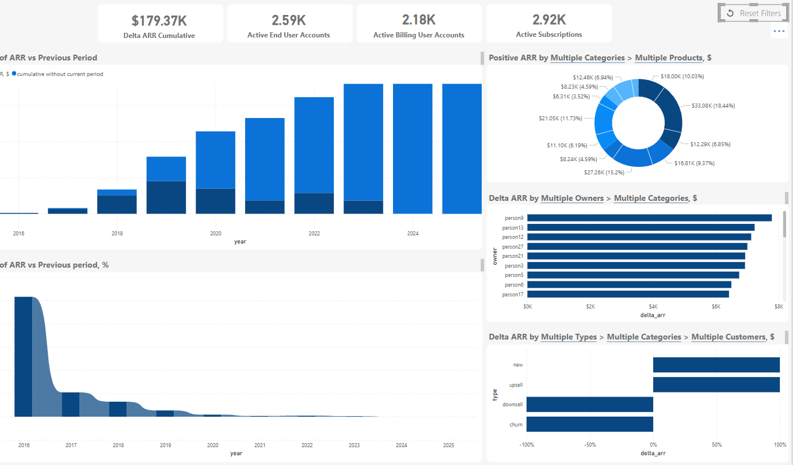

# Revflow: SaaS Revenue Analytics
Revflow: SaaS Revenue Analytics Platform offers key ARR metrics, visual insights, business benefits, and implementation details. The name "Revflow" reflects streamlined revenue analysis in a concise, professional, and memorable way.

## Overview
Revflow is a comprehensive analytics platform designed to track, analyze, and visualize Annual Recurring Revenue (ARR) metrics for subscription-based businesses. The platform provides real-time insights into revenue performance, customer segmentation, and growth trends to support data-driven decision-making.

## Key Features

### Revenue Performance Metrics
- **Delta Annual Revenue  Cumulative:** $179.37K
- **Active End User Accounts:** 2.59K
- **Active Billing User Accounts:** 2.18K
- **Active Subscriptions:** 2.92K

### Visualization Components
- **Annual Revenue vs Previous Period:** Year-over-year growth visualization with cumulative trend analysis
- **Annual Revenue % Change vs Previous Period:** Historical percentage change visualization
- **Positive Annual Revenue by Multiple Categories:** Segmented revenue breakdown with percentage distribution
- **Delta Annual Revenue by Multiple Owners:** Performance tracking across account managers/teams
- **Delta Annual Revenue by Multiple Types:** Revenue segmentation by customer types (new, upsell, downsell, churn)

### Analytics Capabilities
- Multi-dimensional analysis across categories, products, owners, and customer types
- Trend analysis with historical comparisons
- Revenue contribution visualization
- Customer segmentation insights

## Technical Implementation
The dashboard is built using modern data visualization technologies with interactive filtering capabilities. It processes and analyzes subscription data to calculate key SaaS metrics and presents actionable insights through an intuitive interface.

## Business Benefits
- Identify top-performing product categories and revenue streams
- Track account owner performance and contribution
- Monitor customer acquisition, upsell, and churn patterns
- Visualize revenue trends and growth opportunities
- Support strategic decision-making with data-driven insights

## Usage Scenarios
- Executive reporting on revenue performance
- Sales team monitoring and goal tracking
- Product strategy development
- Customer success optimization
- Investor reporting and fundraising

## Getting Started
1. Access the dashboard through your authorized credentials
2. Use filters to customize the view based on time periods, product categories, or customer segments
3. Export reports or share insights with stakeholders as needed
